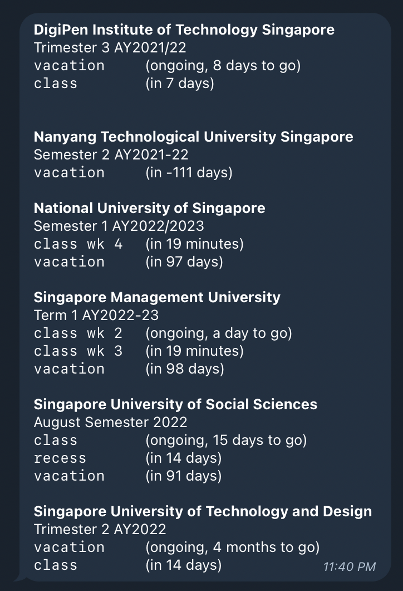

# sgunibot

[](https://github.com/foldaway/sgunibot/actions/workflows/deploy.yml)

This Telegram bot displays information about the current SG uni timetable.



This is set up primarily for development to AWS Lambda, and uses AWS DynamoDB for persistence.

There is no local development mode, and this command can be used to deploy locally to production:
```shell
yarn clean && yarn build && sam build && sam deploy
```

### Setting webhook for production
```shell
yarn set-webhook <AWS Lambda Function URL>
```
